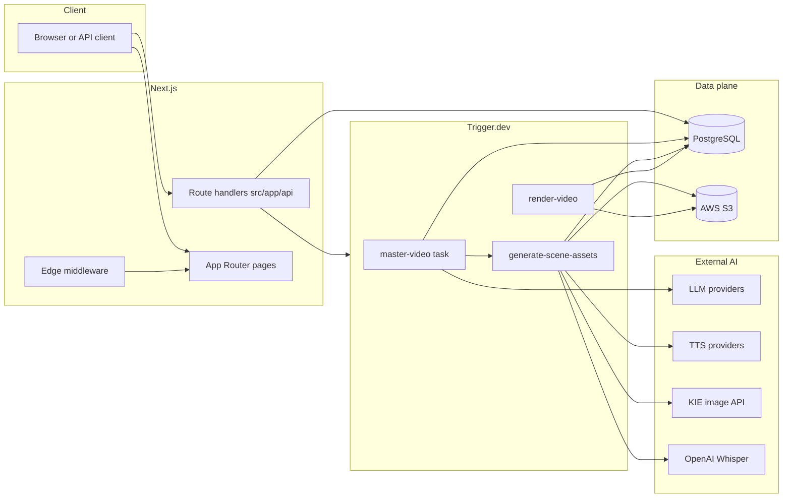
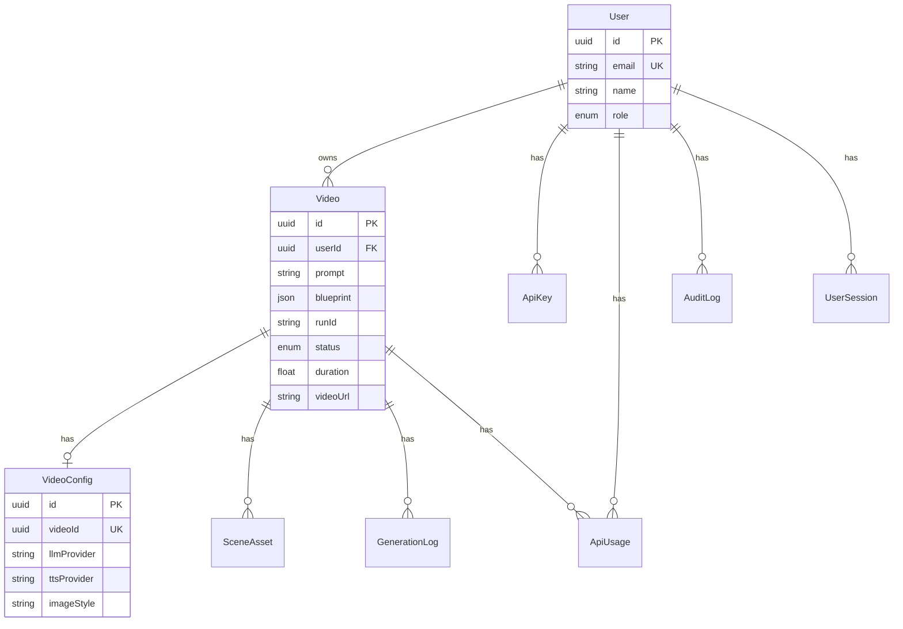
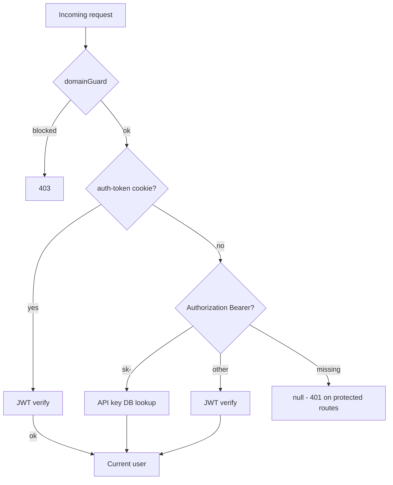
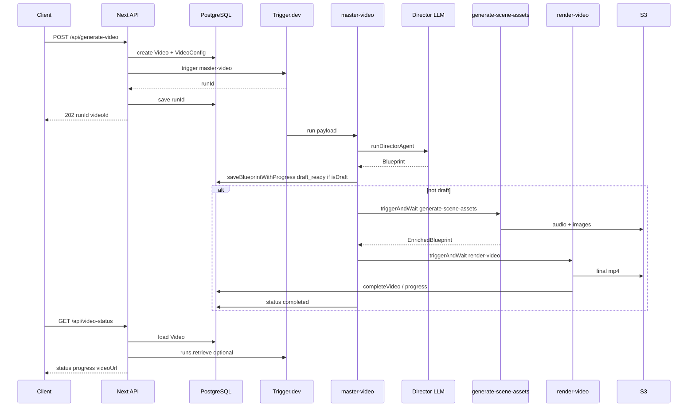
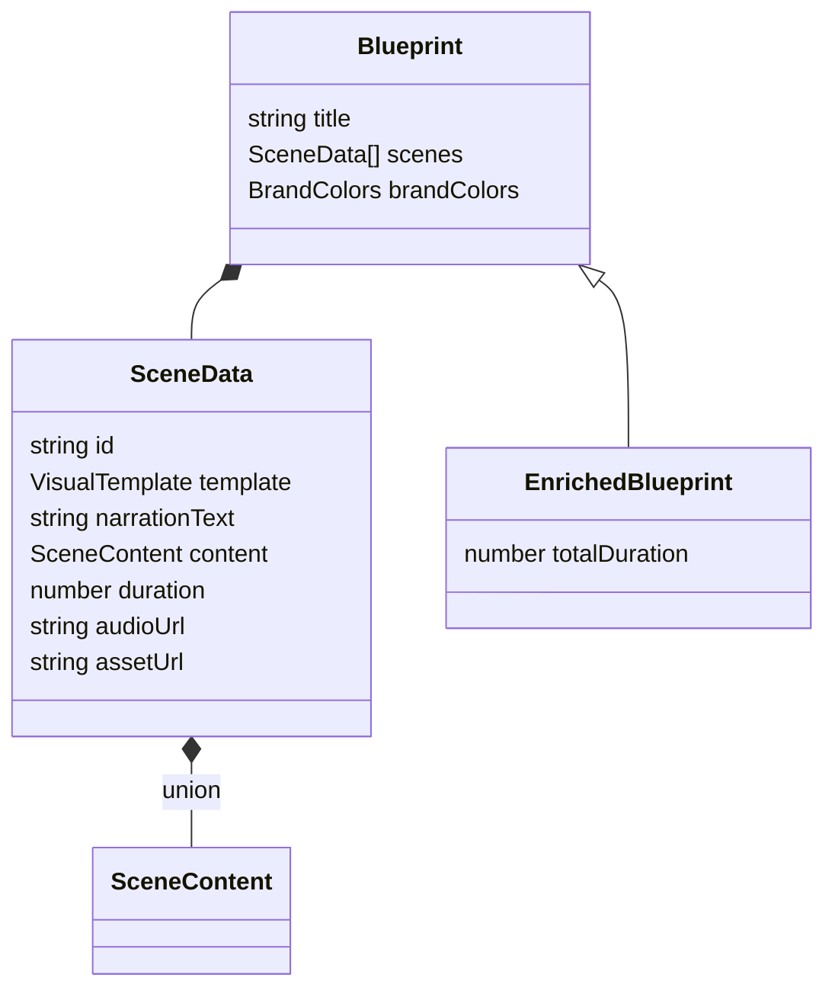

# Nexi System Architecture — Developer Onboarding

This document is the canonical reference for how **Nexi** is structured: what runs where, how requests become rendered videos, and where to change behavior safely.

---

## 1. System overview

Nexi turns a **text prompt** (plus optional images) into a **whiteboard-style explainer video** (MP4). The system:

1. Uses LLMs to produce a structured **Blueprint** (scenes, templates, narration, on-screen content).
2. Generates **per-scene audio** (TTS) and **images** where needed, uploads to **S3**.
3. **Renders** the final video with **Remotion** (frame-accurate composition, captions, branding).

### Tech stack

| Layer | Technology |
|--------|------------|
| App | Next.js 15 (App Router), React 19, TypeScript |
| Validation / types | Zod (`src/types/index.ts`) |
| Database | PostgreSQL via Prisma (`prisma/schema.prisma`) |
| Background jobs | Trigger.dev v4 (`src/trigger/`, `trigger.config.ts`) |
| Video rendering | Remotion 4 (`remotion/`) |
| Auth | JWT (`jose`), httpOnly cookies, Google OAuth, API keys (`sk-…`) |
| Object storage | AWS S3 (`@aws-sdk/client-s3`) |
| Secrets (Trigger deploy) | Infisical sync in `trigger.config.ts` |
| Public docs | Mintlify proxied under `/docs` via `src/middleware.ts` |

### High-level architecture

---

## 2. Directory map

| Path | Purpose |
|------|---------|
| [`src/app/api/`](../src/app/api/) | Next.js Route Handlers — HTTP API surface |
| [`src/trigger/tasks/`](../src/trigger/tasks/) | Trigger.dev tasks: `master-video`, `generate-scene-assets`, `render-video`, `generate-blueprint` |
| [`src/trigger/`](../src/trigger/) | Legacy tasks (`videoPipeline`, `generateAudio`, `generateImage`, old `renderVideo`) and barrel [`index.ts`](../src/trigger/index.ts) |
| [`src/lib/ai/`](../src/lib/ai/) | Director agent, model resolution, image styles, KIE helpers |
| [`src/lib/db/`](../src/lib/db/) | Prisma access: videos, users, api-keys, sessions, audit, etc. |
| [`src/lib/middleware/`](../src/lib/middleware/) | `domainAllowlist`, `rate-limit`, `apiKeyAuth`, `adminAuth`, `ipAllowlist` |
| [`src/lib/auth.ts`](../src/lib/auth.ts) | JWT sign/verify, cookies, `getCurrentUser()` |
| [`src/types/index.ts`](../src/types/index.ts) | Blueprint, scenes, Zod schemas, API response types |
| [`src/components/editor/`](../src/components/editor/) | In-app video editor UI |
| [`remotion/`](../remotion/) | Compositions, 30+ scene templates, captions, branding |
| [`prisma/schema.prisma`](../prisma/schema.prisma) | Database schema |
| [`trigger.config.ts`](../trigger.config.ts) | Trigger project, Prisma extension, Infisical env sync |
| [`src/middleware.ts`](../src/middleware.ts) | **Only** Mintlify `/docs` proxy (not auth) |

---

## 3. Database schema

Prisma models live in [`prisma/schema.prisma`](../prisma/schema.prisma).

### Enums

- **`UserRole`**: `user`, `admin`
- **`AuthProvider`**: `google`, `email`
- **`VideoStatus`**: `processing`, `draft_ready`, `completed`, `failed`
- **`GenStep`**: `blueprint`, `images`, `audio`, `render`
- **`GenStatus`**: `started`, `completed`, `failed`
- **`AssetType`**: `image`, `image_left`, `image_right`, `image_0`…`image_9`, `audio`

### Models (summary)

| Model | Role |
|-------|------|
| **User** | Identity: email, optional password, Google id, role, `kieKeyAlias` |
| **ApiKey** | Hashed API keys (`keyHash`, `keyPrefix`), expiry, last used |
| **Video** | Core job: `prompt`, `blueprint` (JSON), `status`, `runId`, progress fields, `videoUrl`, `error` |
| **VideoConfig** | Per-video provider prefs: `llmProvider`, `ttsProvider`, `imageProvider`, `imageStyle`, `voiceId` |
| **SceneAsset** | Granular assets per `videoId` + `sceneIndex` + `assetType` (used heavily by **legacy** pipeline assembly) |
| **GenerationLog** | Step-level logs for observability |
| **ApiUsage** | Token/cost metadata per call |
| **AuditLog** | Security-relevant actions |
| **UserSession** | Session rows tied to JWT hash |

### ER diagram

---

## 4. Authentication and authorization

Implementation: [`src/lib/auth.ts`](../src/lib/auth.ts).

### Cookie (browser) flow

1. **Google**: `POST /api/auth/google` verifies ID token, upserts user, signs JWT, sets httpOnly `auth-token` cookie (~7 days).
2. **Email**: `POST /api/auth/login` validates password (bcrypt), same JWT + cookie.
3. **`getCurrentUser()`** reads the cookie and `jwtVerify`s with `JWT_SECRET`.

### API key flow

- Header: `Authorization: Bearer sk-…`
- [`src/lib/middleware/apiKeyAuth.ts`](../src/lib/middleware/apiKeyAuth.ts) hashes the key (SHA-256), looks up [`ApiKey`](../prisma/schema.prisma), checks active/expiry, returns a synthetic user payload with `source: "api_key"`.

### Bearer JWT (non-sk)

If the Bearer value does **not** start with `sk-`, it is treated as a JWT (same secret as cookies).

### Typical guard order on sensitive routes

Many handlers apply **in order**:

1. **`domainGuard`** ([`domainAllowlist.ts`](../src/lib/middleware/domainAllowlist.ts)) — optional 403 by `Origin` / `Referer` in production.
2. **`getCurrentUser()`** — 401 if missing.
3. **`checkRateLimit`** — e.g. on `POST /api/generate-video` ([`rate-limit.ts`](../src/lib/middleware/rate-limit.ts)).

---

## 5. Video generation pipeline (primary path)

The **active** orchestrator is **`master-video`** ([`src/trigger/tasks/master-video.ts`](../src/trigger/tasks/master-video.ts)), triggered from the API.

### Entry: `POST /api/generate-video`

File: [`src/app/api/generate-video/route.ts`](../src/app/api/generate-video/route.ts).

1. `domainGuard` → `getCurrentUser()` → `checkRateLimit(userId)` (10 req/min window in [`rate-limit.ts`](../src/lib/middleware/rate-limit.ts)).
2. Parse body: `prompt` (required), optional `userImageUrl` / `userImageUrls` / `userImageDescriptions`, provider IDs, `voiceId`, `skipEditing`, etc.
3. **`createVideo`** → row in `videos` with `status: processing`.
4. **`createVideoConfig`** — stores `llmProvider`, `ttsProvider`, `imageProvider`, `imageStyle`, `voiceId`.
5. **`tasks.trigger("master-video", payload)`** — async run on Trigger.dev.
6. Persist `runId` on the video; return **202** with `{ runId, videoId }`.

**Draft vs full pipeline**

- `isDraft = !body.skipEditing` (default: **draft** if `skipEditing` omitted).
- **Draft (`isDraft: true`)**: `master-video` runs the **Director agent**, saves blueprint, sets **`draft_ready`**, and **returns before** asset generation and render.
- **Full (`skipEditing: true`)**: Director → **`generate-scene-assets`** → **`render-video`** → `completed`.

### Step 1 — Director agent (blueprint)

File: [`src/lib/ai/agents/video-director.ts`](../src/lib/ai/agents/video-director.ts).

- Vercel AI SDK `generateText` with **tools**: `analyzeContent`, `generateBlueprint`, `reviewBlueprint`, `refineScene`.
- Structured output uses schemas from [`src/lib/ai/director-output-schema.ts`](../src/lib/ai/director-output-schema.ts) (strict JSON-schema-friendly Zod), then maps to app `Blueprint` via `blueprintFromDirectorOutput` and **`BlueprintSchema.parse`** from [`src/types/index.ts`](../src/types/index.ts).
- LLM choice via [`resolveLanguageModel`](../src/lib/ai/resolve-model.ts) + `llmProvider` string (registry in [`registry.ts`](../src/lib/ai/registry.ts)).

### Step 2 — Scene assets

File: [`src/trigger/tasks/generate-scene-assets.ts`](../src/trigger/tasks/generate-scene-assets.ts).

- For each scene: TTS (default Sarvam `bulbul:v3` or AI-SDK speech for OpenAI/ElevenLabs), upload MP3 to S3, **Whisper** word alignment, optional **KIE** image generation (with style suffix from [`image-styles.ts`](../src/lib/ai/image-styles.ts)), `vs_split` / user-asset logic.
- Produces an **`EnrichedBlueprint`** (`totalDuration` = sum of scene durations).

### Step 3 — Render

File: [`src/trigger/tasks/render-video.ts`](../src/trigger/tasks/render-video.ts).

- Writes props JSON under `public/generated/`, runs **`npx remotion render`** with entry [`remotion/index.ts`](../remotion/index.ts), composition id **`WhiteboardVideo`** (see [`remotion/Root.tsx`](../remotion/Root.tsx) — aliases `ProfessionalVideo`).
- Uploads MP4 to S3; **`completeVideo`** updates DB (`videoUrl`, `duration`, `status: completed`).

### Status polling: `GET /api/video-status`

File: [`src/app/api/video-status/route.ts`](../src/app/api/video-status/route.ts).

- Query: **`runId`** and/or **`videoId`**.
- Loads `Video` from DB; if `runId` present, **`runs.retrieve(runId)`** maps Trigger status → `PENDING` | `RUNNING` | `COMPLETED` | `FAILED`.
- Returns `progress` from `progress_*` columns; on success includes `videoUrl` from DB or run output.

### Sequence diagram

---

## 6. Blueprint data model

Canonical definitions: [`src/types/index.ts`](../src/types/index.ts).

- **`Blueprint`**: `title`, `scenes: SceneData[]`, optional `userAssetUrl(s)`, `brandColors`, `logoConfig`, `introLogoUrl`, `userImageDescriptions`, `skipEditing`.
- **`SceneData`**: `id`, `template` (VisualTemplate enum), `narrationText`, optional `duration`, `audioUrl`, `assetUrl`, `leftAssetUrl` / `rightAssetIndex`, **`alignment`** (Whisper words or legacy ElevenLabs), **`content`** (discriminated union **SceneContent**), optional layout `displaySettings` / `elementSettings`.
- **`EnrichedBlueprint`**: `Blueprint` + **`totalDuration`** (+ optional preview flags like `forceShowLogo`).

**Universal 30** templates are grouped A–E (typography, data, logic, layouts, metaphors) — see `VisualTemplateSchema` in the same file.

Structured LLM output for the Director uses **`DirectorBlueprintSchema`** / **`DirectorSceneDataSchema`** in [`director-output-schema.ts`](../src/lib/ai/director-output-schema.ts) (stricter than app types for `Output.object`).

---

## 7. AI provider registry

File: [`src/lib/ai/registry.ts`](../src/lib/ai/registry.ts).

- **`createProviderRegistry`**: `anthropic`, `openai`, `google`, `elevenlabs`.
- Defaults: `DEFAULT_LLM`, `DEFAULT_TTS`, image via **KIE** in scene-assets (not the registry’s `DEFAULT_IMAGE_PROVIDER` alone — see KIE in `generate-scene-assets`).
- **Image styles** (`ImageStyle`): `doodle` | `animated-cartoon` | `photorealistic` — prompt suffixes in [`image-styles.ts`](../src/lib/ai/image-styles.ts).

Model resolution / speech wiring: [`src/lib/ai/resolve-model.ts`](../src/lib/ai/resolve-model.ts). Voice validation: [`validate-voice.ts`](../src/lib/ai/validate-voice.ts).

---

## 8. Remotion video composition

- **Entry**: [`remotion/index.ts`](../remotion/index.ts) calls `registerRoot(RemotionRoot)`.
- **Root**: [`remotion/Root.tsx`](../remotion/Root.tsx) — compositions `ProfessionalVideo` and **`WhiteboardVideo`** (same component), 1280×720 @ 30fps, dynamic duration from `blueprint.totalDuration`.
- **Main sequence**: [`remotion/ProfessionalVideo.tsx`](../remotion/ProfessionalVideo.tsx) exports `ProfessionalVideo` and re-exports it as **`WhiteboardVideo`**. [`remotion/Root.tsx`](../remotion/Root.tsx) registers **both** composition IDs (`ProfessionalVideo` and `WhiteboardVideo`) to this component — the CLI in [`render-video.ts`](../src/trigger/tasks/render-video.ts) targets composition **`WhiteboardVideo`**. (`remotion/WhiteboardVideo.tsx` is a separate file; prefer `ProfessionalVideo.tsx` for the canonical pipeline.)
- **Templates**: [`remotion/templates/`](../remotion/templates/) — one component per visual template; indexed in [`templates/index.ts`](../remotion/templates/index.ts).
- **Shared**: [`remotion/components/`](../remotion/components/) — captions, logo, cursor, etc.

**Render task** shells out to CLI — ensure Remotion deps and `npx` are available in the Trigger worker environment.

---

## 9. API route reference

| Method | Path | Notes |
|--------|------|--------|
| GET | `/api` | HTML API documentation (inline page) — [`src/app/api/route.ts`](../src/app/api/route.ts) |
| POST | `/api/generate-video` | Start pipeline; domain + auth + rate limit |
| GET | `/api/video-status` | `runId` and/or `videoId` |
| GET/POST/DELETE/OPTIONS | `/api/videos` | List (auth), create (legacy/simple), delete + S3 cleanup |
| POST | `/api/videos/retry` | Re-trigger `master-video` with resume/restart logic |
| POST | `/api/render-final` | Trigger `render-video` with edited blueprint |
| POST | `/api/regenerate-audio` | Sarvam + Whisper + S3 for editor |
| GET/POST | `/api/api-keys` | List / create keys (dashboard) |
| POST | `/api/upload` | Multipart upload to S3 |
| POST | `/api/upload-image` | Image upload variant |
| POST | `/api/parse-document` | Document parsing (mammoth/pdf pipeline) |
| — | `/api/auth/*` | `google`, `login`, `logout`, `me`, `set-password` |

Admin (typically `admin` role + extra checks — see handlers):

| Method | Path |
|--------|------|
| GET | `/api/admin/users` |
| GET | `/api/admin/stats` |
| GET/POST | `/api/admin/api-keys` |

**OpenAPI**: [`docs/openapi.yaml`](openapi.yaml) may duplicate or extend this; treat route files as source of truth when they differ.

---

## 10. Editor and draft workflow

1. **Draft generation** (`skipEditing` false / omitted): `master-video` stops after blueprint → **`draft_ready`**. User opens **`/editor/[videoId]`** ([`src/app/editor/[videoId]/page.tsx`](../src/app/editor/[videoId]/page.tsx)) and uses editor components under [`src/components/editor/`](../src/components/editor/).
2. **Edit** blueprint JSON client-side (scene content, narration, ordering — as implemented in `VideoEditor` and related components).
3. **`POST /api/regenerate-audio`**: per-scene audio regen (Sarvam + Whisper + S3) for edited narration.
4. **`POST /api/render-final`**: triggers **`render-video`** with the **enriched** blueprint the editor sends (must include durations/assets as expected by Remotion).

**Full one-shot** (`skipEditing: true`): no editor stop; assets + render run inside `master-video`.

---

## 11. Middleware stack (`src/lib/middleware/`)

| Module | Responsibility |
|--------|----------------|
| [`domainAllowlist.ts`](../src/lib/middleware/domainAllowlist.ts) | Allowlisted `Origin`/`Referer` in production; server-to-server calls often have no origin → allowed |
| [`rate-limit.ts`](../src/lib/middleware/rate-limit.ts) | In-memory fixed window per key (used from route handlers) |
| [`apiKeyAuth.ts`](../src/lib/middleware/apiKeyAuth.ts) | Parse `Bearer sk-…`, validate against DB |
| [`adminAuth.ts`](../src/lib/middleware/adminAuth.ts) | Admin-only operations |
| [`ipAllowlist.ts`](../src/lib/middleware/ipAllowlist.ts) | Optional IP restrictions |

**Note:** [`src/middleware.ts`](../src/middleware.ts) at repo root is **only** for **Mintlify `/docs` proxying**, not authentication.

**Other:** [`src/lib/jwtMiddleware.ts`](../src/lib/jwtMiddleware.ts) exists as a **stub** / future external-JWT hook — production routes use [`getCurrentUser()`](../src/lib/auth.ts) instead.

---

## 12. Legacy pipeline

- [`src/trigger/videoPipeline.ts`](../src/trigger/videoPipeline.ts) — **deprecated**; comment at top points to `master-video`. Uses direct Anthropic blueprint generation, Trigger **`batch.triggerByWait`** for `generateImage` / `generateAudio`, `assembleBlueprint` from DB `scene_assets`, optional `renderVideo` legacy task.
- [`src/trigger/renderVideo.ts`](../src/trigger/renderVideo.ts) — legacy render used by old pipeline; **new** code uses [`src/trigger/tasks/render-video.ts`](../src/trigger/tasks/render-video.ts).
- Barrel exports in [`src/trigger/index.ts`](../src/trigger/index.ts) document which exports are current vs legacy.

**Auxiliary task:** [`src/trigger/tasks/generate-blueprint.ts`](../src/trigger/tasks/generate-blueprint.ts) defines **`generate-blueprint`** (Claude + image analysis). The **`master-video`** path uses the **Director agent** ([`video-director.ts`](../src/lib/ai/agents/video-director.ts)) for blueprint creation instead of triggering this task, but the task remains available for experiments or future wiring.

---

## 13. Environment variables (grouped)

Do not commit secrets. Typical groups:

| Group | Variables |
|-------|-----------|
| Database | `DATABASE_URL`, `DIRECT_URL` |
| Auth | `JWT_SECRET`, `GOOGLE_CLIENT_ID` (+ Google client secret where used) |
| AI | `ANTHROPIC_API_KEY`, `OPENAI_API_KEY`, `SARVAM_API_KEY`, ElevenLabs keys if used |
| AWS | `AWS_ACCESS_KEY_ID`, `AWS_SECRET_ACCESS_KEY`, `AWS_S3_BUCKET_NAME`, `AWS_REGION` |
| Trigger.dev | `TRIGGER_SECRET_KEY` (and project ref in `trigger.config.ts`) |
| Infisical (Trigger build) | `INFISICAL_CLIENT_ID`, `INFISICAL_CLIENT_SECRET` |
| KIE | Resolved per user via [`resolve-kie-key`](../src/worker/utils/resolve-kie-key.ts) / env |

---

## 14. Scripts and commands

From [`package.json`](../package.json):

| Script | Purpose |
|--------|---------|
| `dev` | `next dev` |
| `build` / `start` | Production Next.js |
| `lint` | `next lint` |
| `postinstall` | `prisma generate` |
| `trigger:dev` | Local Trigger.dev |
| `deploy:trigger` / `deploy:trigger:staging` | Deploy workers |
| `remotion:studio` / `remotion:build` | Remotion CLI |
| `lambda:deploy` | `scripts/lambda-deploy.ts` |
| `lambda:info` / `lambda:quotas` | Remotion Lambda helpers |

---

## Contributing: where to change what

| Goal | Start here |
|------|------------|
| New API behavior | `src/app/api/.../route.ts` |
| Prompting / Director logic | `src/lib/ai/agents/video-director.ts`, `director-output-schema.ts` |
| TTS / image / Whisper behavior | `src/trigger/tasks/generate-scene-assets.ts` |
| Render CLI / output | `src/trigger/tasks/render-video.ts`, `remotion/` |
| New visual template | `src/types/index.ts` (schema + union) + `remotion/templates/Scene_*.tsx` + `WhiteboardVideo` switch |
| Auth rules | `src/lib/auth.ts`, `src/lib/middleware/*` |
| DB shape | `prisma/schema.prisma` + migration |

---

## Related docs

- Trigger: [`trigger.config.ts`](../trigger.config.ts)
- External HTTP API spec: [`openapi.yaml`](openapi.yaml) (same `docs/` folder)
- Postman: `Nexi-API-Test-Suite.postman_collection.json` (if present in repo)
